# C115-mininet-final

### Exercício 1

a) Criando a toplogia em árvore com profundidade 3 e ramificação 5. A topologia foi criada com endereço MAC padronizado e uma largura de banda de 30Mbps

Comando: sudo mn --topo=tree,depth=3,fanout=5 --mac --link=tc,bw=30

b) Inspecione informações das interfaces, endereços MAC, IP e portas através de linhas de comando;

Comando: nodes

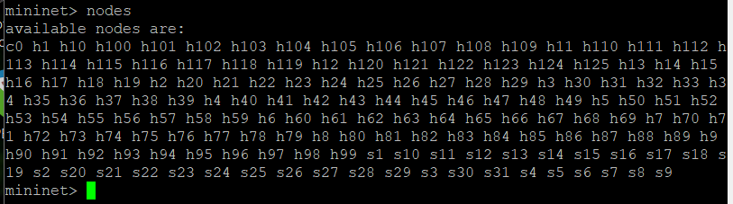

Comando: net

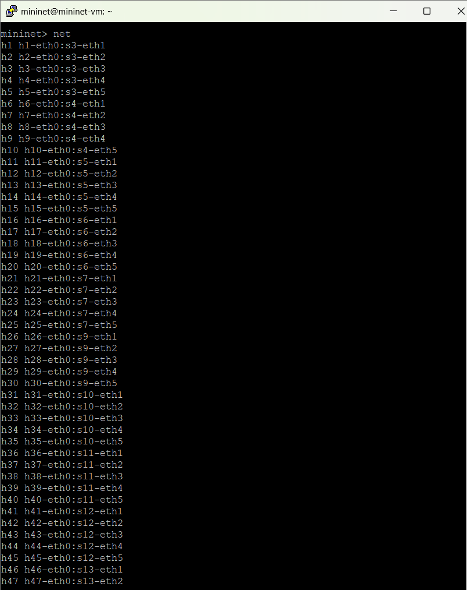

Comando: dump

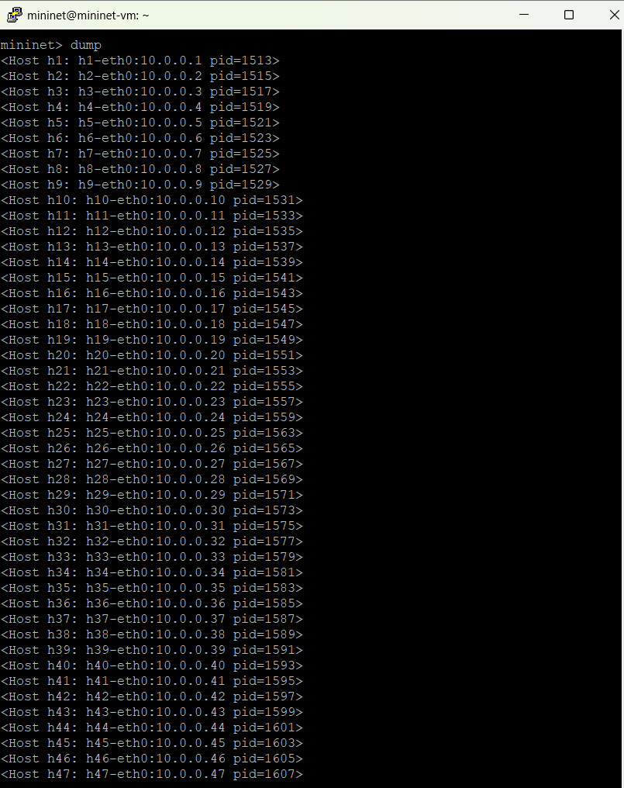

Comando: h1 ifconfig -a

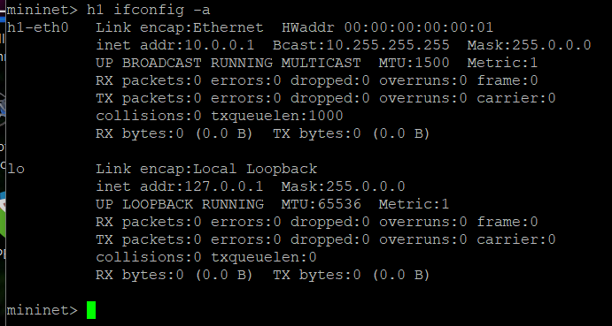

Comando: s1 ifconfig -a

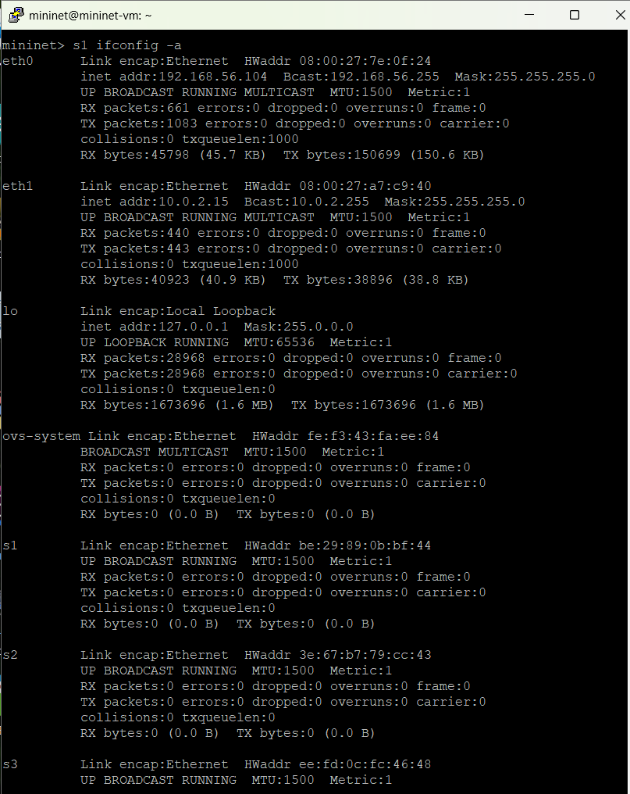

c) Crie um desenho ilustrativo da topologia com todas as informações obtidas no item anterior;

d) Execute testes de ping entre os diferentes nós, mostre os pacotes chegando nos nós com uso do comando tcpdump.

Comando: xterm h1 h2

(Abre dois terminais para host 1 e host 2)

Comando em h1: tcpdump -XX -n -i h1-eth0

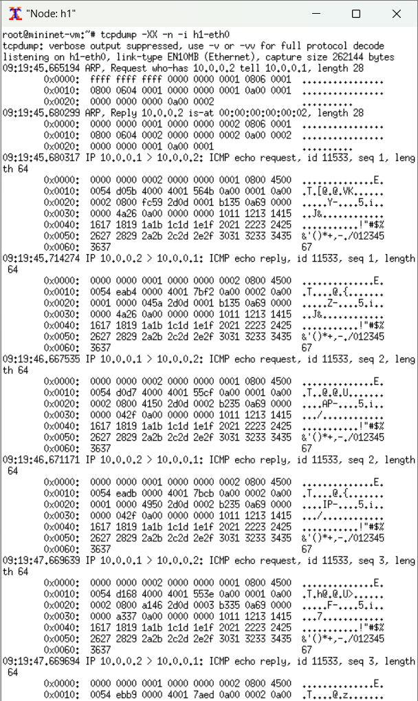
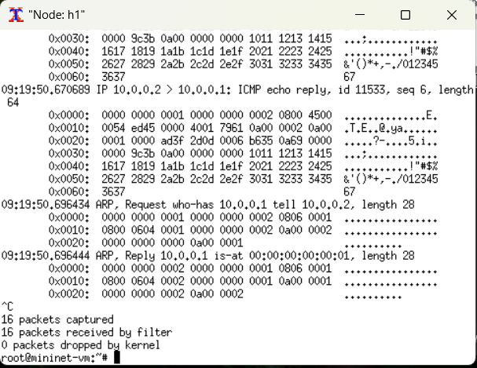

Comando em h2: tcpdump -XX -n -i h2-eth0

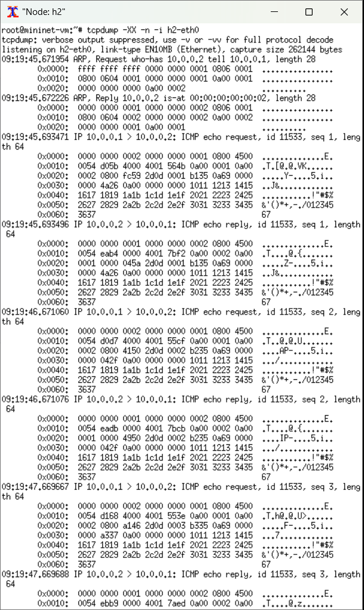
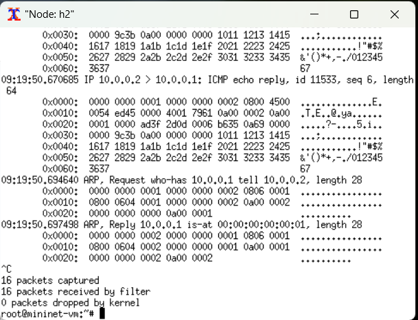

Comando: h1 ping h2

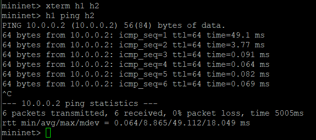

e) Especifique que o host 1 na porta 5555 vai ser um servidor TCP e o host 2 um cliente e execute testes de iperf, considere um relatório por segundo com teste de 20 segundos. Faça os testes para larguras de banda bw de 30 e 40 Mbps (Necessário reconstruir a topologia para os outros valores).

**Com largura de banda de 30Mbps**

Comando em h1: iperf -s -p 5555 -i 1

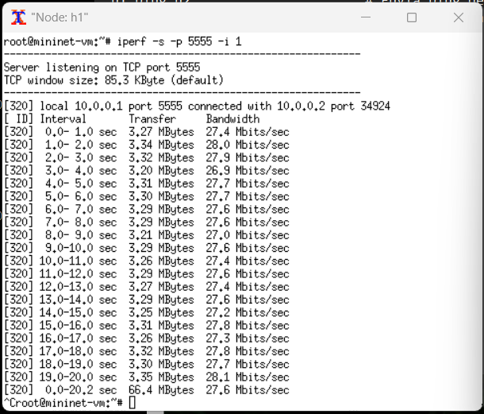

Comando em h2: iperf -c 10.0.0.1 -p 5555 -i 1 -t 20

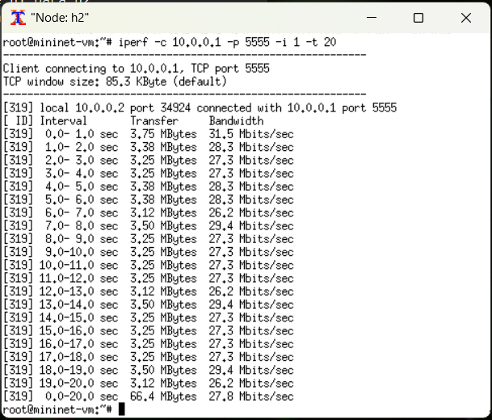

**Com largura de banda de 40Mbps**

Comando em h1: iperf -s -p 5555 -i 1

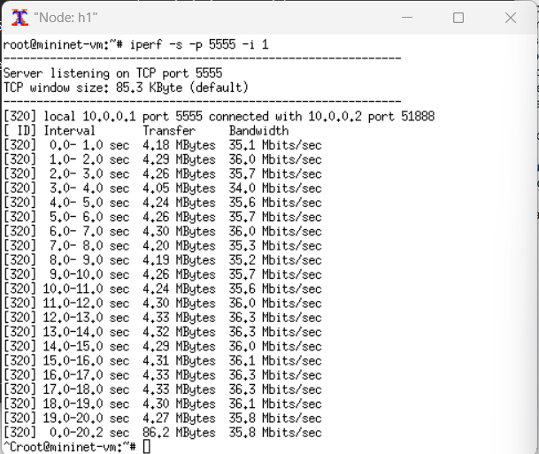

Comando em h2: iperf -c 10.0.0.1 -p 5555 -i 1 -t 20

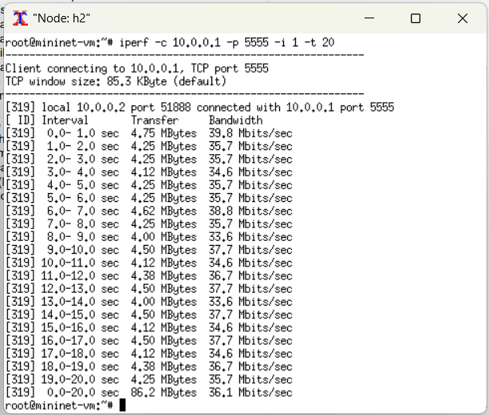

### Exercício 2

a) Topologia criada pelo script python "execicio2.py".

b) Foram inspecionadas as informações das interfaces, endereços MAC, IP e portas através de linhas de comando.

Comando: nodes

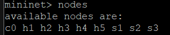

Comando: net

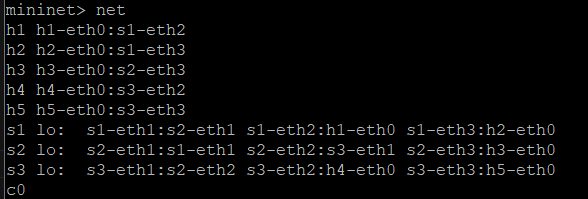

Comando: dump

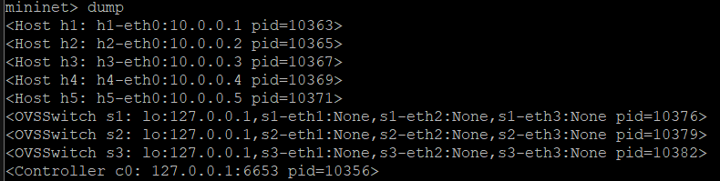

c) Crie um desenho ilustrativo da topologia com todas as informações obtidas no item anterior;

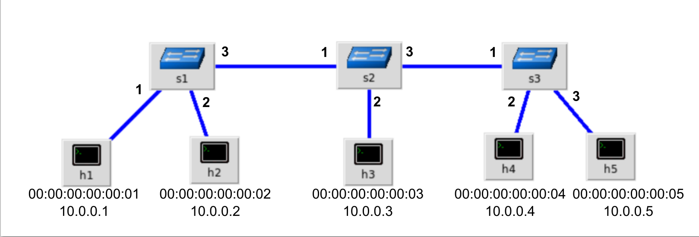

d) Testes de conectividade antes de mudar as regras

Comando: pingall

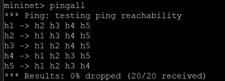

Comando: h1 ping h4

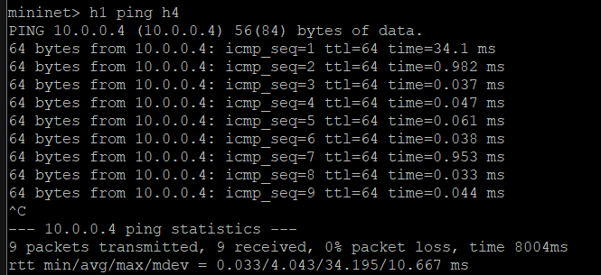

e) Foram apagadas as regras anteriores e novas regras foram criadas.

f) Após isso foram feitos os testes de conectividade novamete via script python.

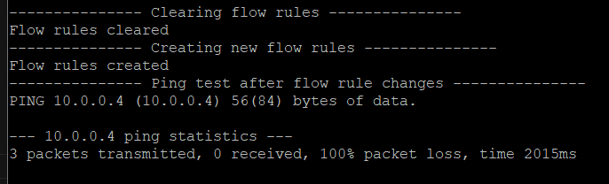
