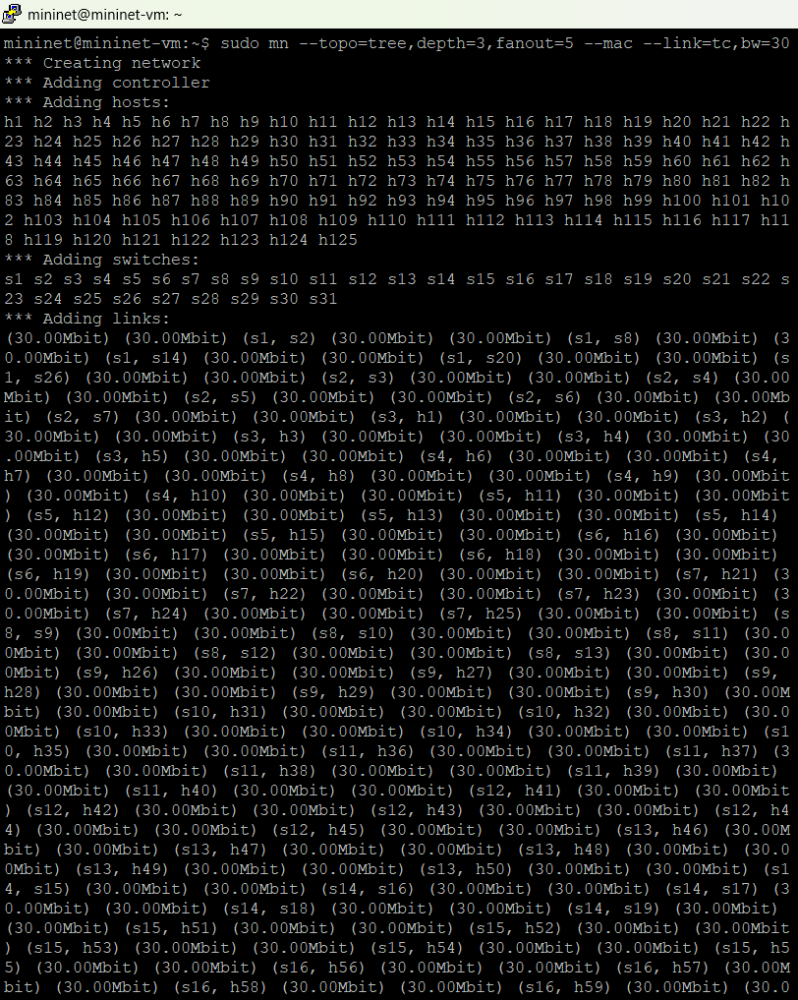

# C115-mininet-final

### Exercício 1

a) Criando a toplogia em árvore com profundidade 3 e ramificação 5. A topologia foi criada com endereço MAC padronizado e uma largura de banda de 30Mbps

**Comando:** sudo mn --topo=tree,depth=3,fanout=5 --mac --link=tc,bw=30

b) Inspecione informações das interfaces, endereços MAC, IP e portas através de linhas de comando;

**Comando:** nodes
             
             net
             
             dump
             
             h1 ifconfig -a
             
             s1 ifconfig -a

c) Crie um desenho ilustrativo da topologia com todas as informações obtidas no item anterior;

d) Execute testes de ping entre os diferentes nós, mostre os pacotes chegando nos nós com uso do comando tcpdump.

**Comando:**   xterm h1 h2
               
               tcpdump -XX -n -i h1-eth0
              
               tcpdump -XX -n -i h2-eth0
               
               h1 ping h2

e) Especifique que o host 1 na porta 5555 vai ser um servidor TCP e o host 2 um cliente e execute testes de iperf, considere um relatório por segundo com teste de 20 segundos. Faça os testes para larguras de banda bw de 30 e 40 Mbps (Necessário reconstruir a topologia para os outros valores).

**Comando:** iperf -s -p 5555 -i 1
             
             iperf -c 10.0.0.1 -p 5555 -i 1 -t 20
             
             sudo mn -c
             
             sudo mn --topo=tree,depth=3,fanout=5 --mac --link-tc,bw=40

2) Crie um código Python para a topologia customizada abaixo
   
a) Com uso de linha de comando padrão do Mininet, crie a topologia customizada considerando o endereço MAC padronizado e controlador manual;

b) Inspecione informações das interfaces, endereços MAC, IP e portas através de linhas de comando;

c) Crie um desenho ilustrativo da topologia com todas as informações obtidas no item anterior;

d) Faça testes de ping considerando os switches normais;

e) Apague as regras anteriores e crie regras baseadas em endereços MAC para alguns nós. (Deve-se comunicar hosts dos diferentes switches);

f) Faça testes de ping para demonstrar que as regras foram bem implementadas

